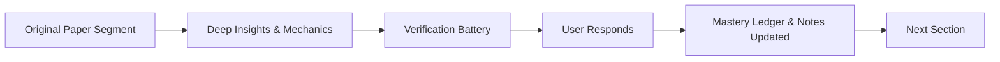

# Paper Reading Harness & Pedagogical Framework

A structured, interactive harness for reading machine learning and mechanistic interpretability papers section-by-section without cognitive overload.

---

## 1. Objectives & Principles

1. **Deconstruct Dense Text**: Break down academic papers into self-contained units (subsections or logical chunks).
2. **Multi-Lens Insight**: Analyze every section through 4 key lenses:
   - **Theoretical & Mathematical Mechanics** (equations, inductive biases, formal definitions)
   - **Compute & Engineering Reality** (FLOPs, memory footprints, Colab T4 vs. H100 feasibility)
   - **Industry & Practical Deployment** (monitoring, safety, feature steering, tooling)
   - **Mechanistic Context** (superposition, monosemanticity, circuit discovery)
3. **Active Recall & Mastery Verification**: Validate comprehension through targeted probing questions before moving forward.
4. **Persistent State & Performance Tracking**: Maintain a persistent session log of progress, answers, mastery scores, and emerging research ideas.

---

## 2. Step Protocol

For every iteration:

1. **Source Segment**: Verbatim excerpt of the section with page/section anchors.
2. **Core Concepts & Deep Insights**:
   - High-density synthesis (no fluff).
   - Mathematical / algorithmic deconstruction.
   - Resource & compute implications (reproducibility check).
3. **Verification Battery**:
   - Diagnostic questions testing understanding of assumptions, math, failure modes, and trade-offs.
4. **Interactive Evaluation & Logging**:
   - Grade user response, clarify nuances, log state to session markdown, and advance to next chunk.

---

## 3. Session State Schema

Every reading session maintains a ledger (`docs/notes/session-{slug}.md`):
- **Paper Metadata**: Title, arXiv ID, authors, venue, link.
- **Progress Ledger**: Current Section, Page, % Completed, Total Sections.
- **Scorecard**: Questions asked, answered correctly, misconceptions clarified.
- **Synthesized Notes**: Takeaways accumulated for the final `docs/papers/{slug}.md`.
